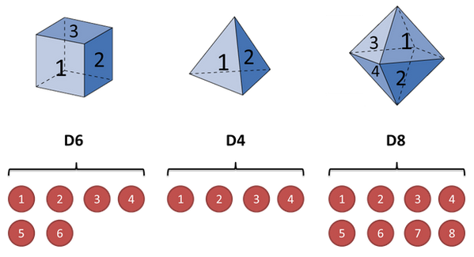
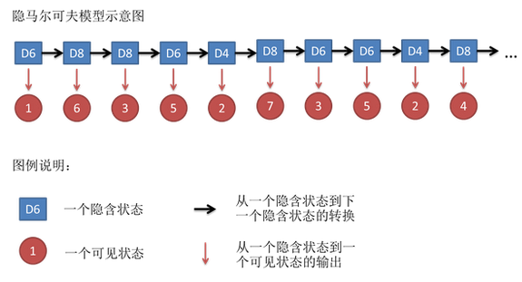
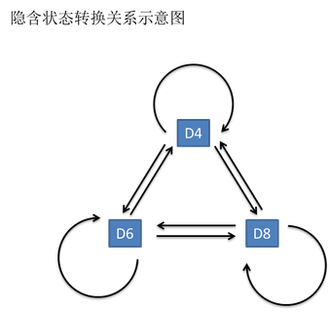
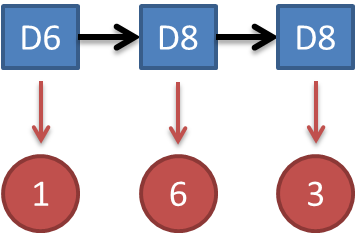
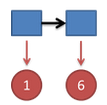
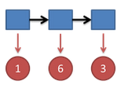

# HMM

## HMM 模型

隐马尔可夫模型（Hidden Markov Model，HMM）是统计模型，**它用来描述一个含有隐含未知参数的马尔可夫过程**。其难点是从可观察的参数中确定该过程的隐含参数。然后利用这些参数来作进一步的分析，例如模式识别。

下面用一个简单的例子来阐述。假设我手里有三个不同的骰子。第一个骰子是我们平常见的骰子（称这个骰子为D6），6个面，每个面（1，2，3，4，5，6）出现的概率是1/6。第二个骰子是个四面体（称这个骰子为D4），每个面（1，2，3，4）出现的概率是1/4。第三个骰子有八个面（称这个骰子为D8），每个面（1，2，3，4，5，6，7，8）出现的概率是1/8。

假设我们开始掷骰子，我们先从三个骰子里挑一个，挑到每一个骰子的概率都是1/3。然后我们掷骰子，得到一个数字，1，2，3，4，5，6，7，8中的一个。不停的重复上述过程，我们会得到一串数字，每个数字都是1，2，3，4，5，6，7，8中的一个。例如我们可能得到这么一串数字（掷骰子10次）：1 6 3 5 2 7 3 5 2 4

这串数字叫做**可见状态链**。但是在隐马尔可夫模型中，我们不仅仅有这么一串可见状态链，还有一串**隐含状态链**。在这个例子里，这串隐含状态链就是你用的骰子的序列。比如，隐含状态链有可能是：D6 D8 D8 D6 D4 D8 D6 D6 D4 D8

一般来说，**HMM 中说到的马尔可夫链其实是指隐含状态链**，因为**隐含状态（骰子）之间存在转换概率（transition probability）**。在我们这个例子里，D6的下一个状态是D4，D6，D8的概率都是1/3。D4，D8的下一个状态是D4，D6，D8的转换概率也都一样是1/3。这样设定是为了最开始容易说清楚，但是我们其实是可以随意设定转换概率的。比如，我们可以这样定义，D6后面不能接D4，D6后面是D6的概率是0.9，是D8的概率是0.1。这样就是一个新的HMM。

同样的，尽管可见状态之间没有转换概率，但是**隐含状态和可见状态之间有一个概率叫做输出概率（emission probability）**。就我们的例子来说，六面骰（D6）产生1的输出概率是1/6。产生2，3，4，5，6的概率也都是1/6。我们同样可以对输出概率进行其他定义。比如，我有一个被赌场动过手脚的六面骰子，掷出来是1的概率更大，是1/2，掷出来是2，3，4，5，6的概率是1/10。

其实对于HMM来说，如果提前知道所有隐含状态之间的转换概率和所有隐含状态到所有可见状态之间的输出概率，做模拟是相当容易的。但是应用HMM模型时候呢，往往是缺失了一部分信息的，有时候你知道骰子有几种，每种骰子是什么，但是不知道掷出来的骰子序列；有时候你只是看到了很多次掷骰子的结果，剩下的什么都不知道。如果应用算法去估计这些缺失的信息，就成了一个很重要的问题。这些算法我会在下面详细讲。

总结：
1. 隐马尔可夫模型用来描述一个含有隐含未知参数的马尔可夫过程。
2. HMM 中说到的马尔可夫链其实是指隐含状态链。
3. 隐含状态之间存在转换概率（transition probability）。
4. 隐含状态和可见状态之间有一个概率叫做输出概率（emission probability）。
5. 隐马尔可夫模型中还有一个可见状态链。

## 一个简单问题的求解

知道骰子有几种，每种骰子到其它骰子的转换概率，每次投的都是什么骰子，根据骰子的掷出结果，求产生这个结果的概率。

对应到隐马尔可夫模型中就是知道了隐含状态链、转换概率、输出概率、可见状态链。

## 问题一

看见不可见的，破解骰子序列 

知道骰子有几种（隐含状态数量），每种骰子是什么（转换概率），根据掷骰子掷出的结果（可见状态链），我想知道每次掷出来的都是哪种骰子（隐含状态链）。

对应到隐马尔可夫模型中就是知道了可见状态链、转换概率、输出概率，求解隐含状态链。

其实最简单而暴力的方法就是穷举所有可能的骰子序列，然后依照第零个问题的解法把每个序列对应的概率算出来。然后我们从里面把对应最大概率的序列挑出来就行了。如果马尔可夫链不长，当然可行，如果长的话，穷举的数量太大，就很难完成了。 

另外一种很有名的算法叫做Viterbi algorithm。 要理解这个算法，我们先看几个简单的例子。

首先，如果我们只掷一次骰子：

从上图中可以看到投掷结果为1。则对应的最大概率骰子序列就是D4，因为D4产生1的概率是1/4，高于1/6和1/8。

把这个情况拓展，我们掷两次骰子：

从上图中可以看到投掷结果为1，6。这时问题变得复杂起来，我们要计算三个值，分别是第二个骰子是D6，D4，D8的最大概率。已经知道第一个骰子为D4，这时第二个骰子取到D6的最大概率是：

同样的，我们可以计算第二个骰子是D4或D8时的最大概率。我们发现，第二个骰子取到D6的概率最大。而使这个概率最大时，第一个骰子为D4。所以最大概率骰子序列就是D4 D6。 

继续拓展，我们掷三次骰子：

我们计算第三个骰子分别是D6，D4，D8的最大概率。我们再次发现，已知第一个骰子是D4，第二个骰子是D6。第三个骰子取到D4的最大概率是：

同上，我们可以计算第三个骰子是D6或D8时的最大概率。我们发现，第三个骰子取到D4的概率最大。而使这个概率最大时，第二个骰子为D6，第一个骰子为D4。所以最大概率骰子序列就是D4 D6 D4。

写到这里，大家应该看出点规律了。既然掷骰子一二三次可以算，掷多少次都可以以此类推。我们发现，我们要求最大概率骰子序列时要做这么几件事情。首先，不管序列多长，要从序列长度为1算起，算序列长度为1时取到每个骰子的最大概率。然后，逐渐增加长度，每增加一次长度，重新算一遍在这个长度下最后一个位置取到每个骰子的最大概率。因为上一个长度下的取到每个骰子的最大概率都算过了，重新计算的话其实不难。当我们算到最后一位时，就知道最后一位是哪个骰子的概率最大了。然后，我们要把对应这个最大概率的序列从后往前推出来。 
